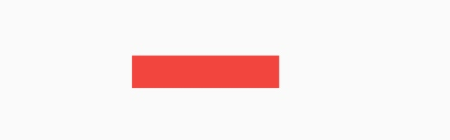
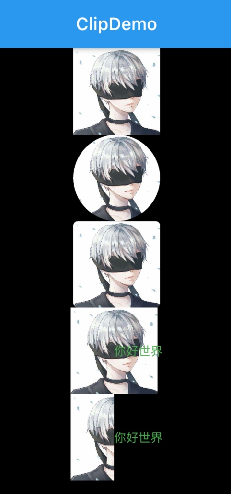

# 第五章 容器类组件 

* 布局类Widget一般都需要接收一个widget数组（children），他们直接或间接继承自（或包含）MultiChildRenderObjectWidget ；而容器类Widget一般只需要接收一个子Widget（child），他们直接或间接继承自（或包含）SingleChildRenderObjectWidget。
* 布局类Widget是按照一定的排列方式来对其子Widget进行排列；而容器类Widget一般只是包装其子Widget，对其添加一些修饰（补白或背景色等）、变换(旋转或剪裁等)、或限制(大小等)。

## 填充 Padding
### Padding 
可以给子节点添加填充。

```dart
  EdgeInsetsGeometry padding,
  Widget child,
  })
```

EdgeInsetsGeometry 是抽象类，一般直接使用其子类EedgInsets。

* fromLTRB(double left, double top, double right, double bottom)：分别指定四个方向的填充。
* all(double value) : 所有方向均使用相同数值的填充。
* only({left, top, right ,bottom })：可以设置具体某个方向的填充(可以同时指定多个方向)。
* symmetric({ vertical, horizontal })：用于设置对称方向的填充，vertical指top和bottom，horizontal指left和right


## 尺寸限制类容器

### ConstrainedBox 

```dart

@override
RenderConstrainedBox createRenderObject(BuildContext context) {
return RenderConstrainedBox(additionalConstraints: constraints);
}

```
### sizeBox

### 多重限制
多重限制时，对于minWidth和minHeight来说，是取父子中相应数值较大的。实际上，只有这样才能保证父限制与子限制不冲突。

### UnconstrainedBox
一般不会直接使用此组件，此组件可以去除父组件的限制，但是不是真正的彻底祛除，只是子组件按照本身大小绘制。



注：如果发现父组件限制无效可以考虑使用UnconstrainedBox 去除限制。

## DecoratedBox 装饰容器
DecoratedBox可以在子组件绘制前或后绘制一些装饰，背景、边框、渐变等

```dart
const DecoratedBox({
  Decoration decoration,
  DecorationPosition position = DecorationPosition.background,
  Widget child
})
```
1. decoration 表示绘制的装饰，类型为Decoration，Decoration定义了createBoxPainter，子类的职责主要是创建画笔。
2. position 决定在哪绘制装饰：
    * background 表示在子组件之后绘制，背景
    * foreground 表示在子组件之前绘制。前景

#### BoxDecoration
通常直接使用BoxDecoration

```dart
BoxDecoration({
  Color color, //颜色
  DecorationImage image,//图片
  BoxBorder border, //边框
  BorderRadiusGeometry borderRadius, //圆角
  List<BoxShadow> boxShadow, //阴影,可以指定多个
  Gradient gradient, //渐变
  BlendMode backgroundBlendMode, //背景混合模式
  BoxShape shape = BoxShape.rectangle, //形状
})
```

## Transform 变换
Transform 可以在子组件绘制时应用一些特效。
由于变换在子组件绘制时，无需重新布局和构建，因此性能比较好。

### 矩阵
### 平移
### 旋转
### 缩放
### RotatedBox
RotatedBox 和 Transform.rotate功能类似，不过前者变换发生在布局阶段，后者变换发生在绘制阶段。
## Container 容器


## Scaffold tabBar 底部导航
### Scaffold
####  AppBar

```dart
AppBar({
  Key key,
  this.leading, //导航栏最左侧Widget，常见为抽屉菜单按钮或返回按钮。
  this.automaticallyImplyLeading = true, //如果leading为null，是否自动实现默认的leading按钮
  this.title,// 页面标题
  this.actions, // 导航栏右侧菜单
  this.bottom, // 导航栏底部菜单，通常为Tab按钮组
  this.elevation = 4.0, // 导航栏阴影
  this.centerTitle, //标题是否居中 
  this.backgroundColor,
  ...   //其它属性见源码注释
})
```

通过Scaffold.of(context)可以获取父级最近的Scaffold 组件的State对象

### TabBar

PageView

## Clip 剪裁


| widget    | 作用                         |
|-----------|----------------------------|
| ClipOval  | 子组件为正方形时裁剪为内切圆，为矩形时裁剪为内切椭圆 |
| ClipRRect | 将子组件裁剪为圆角矩形                |
| ClipRect  | 剪切子组件到实际占用的矩形大小            |


```dart

    Column(
            children: <Widget>[
              avatar,
              ClipOval(child: avatar,),
              ClipRRect(
                borderRadius: BorderRadius.circular(5.0),
                child: avatar,
              ),
              Row(
                mainAxisAlignment: MainAxisAlignment.center,
                children: <Widget>[
                  Align(
                    alignment: Alignment.topLeft,
                    widthFactor: .5,
                    child: avatar,
                  ),
                  Text("你好世界", style: TextStyle(color: Colors.green),)
                ],
              ),
              Row(
                mainAxisAlignment: MainAxisAlignment.center,
                children: <Widget>[
                  ClipRect(
                    child: Align(
                      alignment: Alignment.topLeft,
                      widthFactor: .5,
                      child: avatar,
                    ),
                  ),
                  Text("你好世界", style: TextStyle(color: Colors.green),)
                ],
              )
            ],
          ),

```




